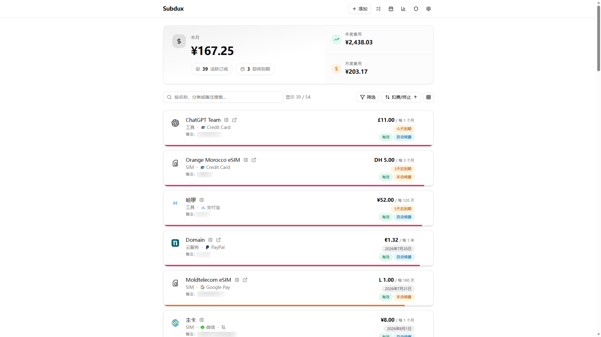
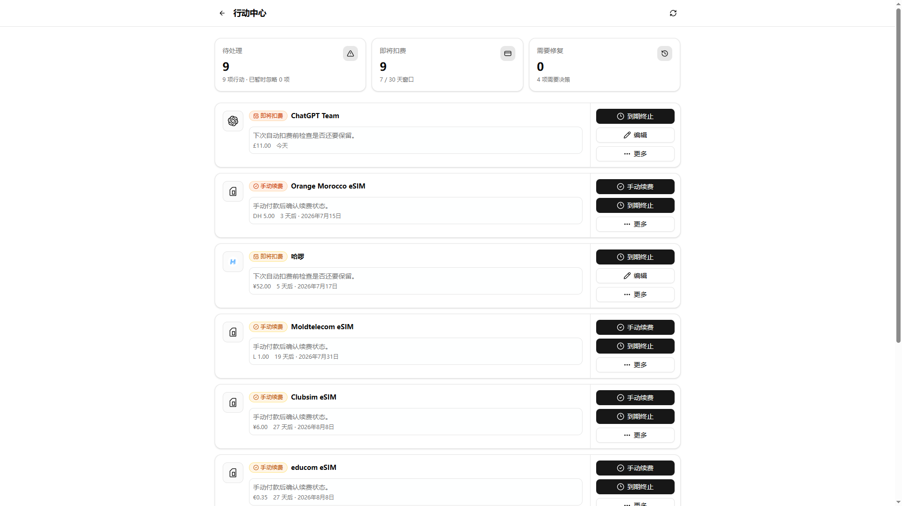
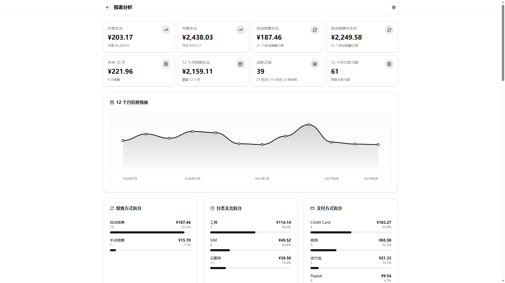
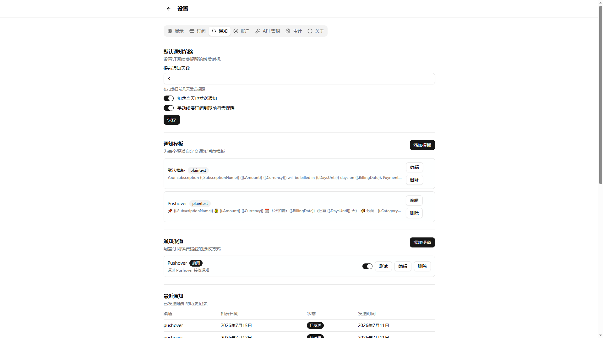
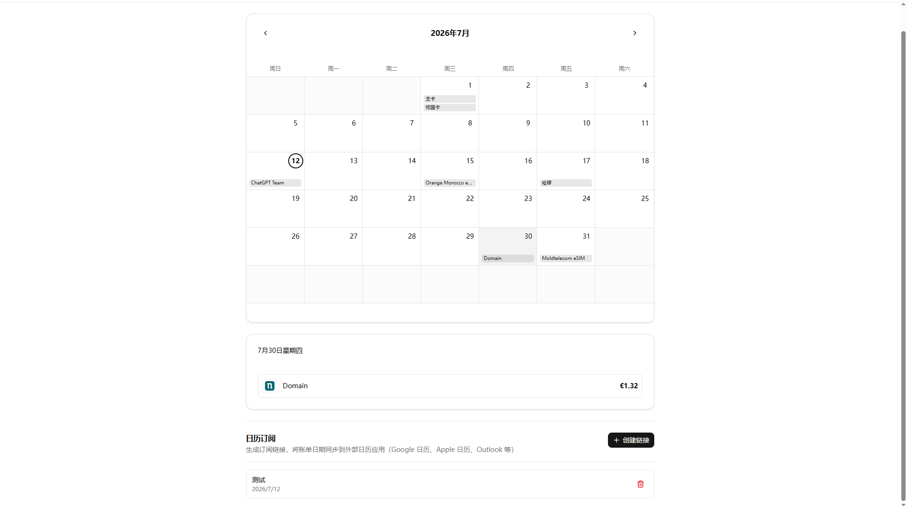
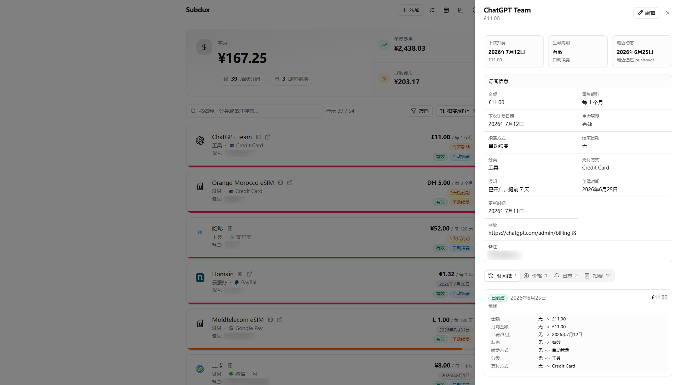

# Subdux

[](https://github.com/kasuha07/subdux/actions/workflows/ci.yml)
[](https://github.com/kasuha07/subdux/pkgs/container/subdux)
[](LICENSE)

<p align="center">
  
</p>

<p align="center">
  <strong>Know what renews next. Decide before it charges.</strong>
</p>

<p align="center">
  A self-hosted command center for recurring expenses—subscriptions, renewals,
  reminders, and the decisions around them.
</p>

<p align="center">
  <a href="#quick-start"><strong>Get started</strong></a> ·
  <a href="#automation-and-mcp">Connect an agent</a> ·
  <a href="#what-subdux-gives-you">Explore the product</a> ·
  <a href="docs/README.zh-CN.md">简体中文</a>
</p>

---

Subdux turns recurring subscription charges scattered across different services into a clear, actionable timeline. See when the next charge is due, understand the real cost across currencies, and decide whether to renew or cancel before the bill arrives.

It ships as a single binary and deploys with one Docker command. Your subscription records and notification settings stay on your own infrastructure.

## Screenshots

<table>
  <tr>
    <td width="33.33%" align="center">
      
      <br>
      <strong>Dashboard</strong>
    </td>
    <td width="33.33%" align="center">
      
      <br>
      <strong>Action Center</strong>
    </td>
    <td width="33.33%" align="center">
      
      <br>
      <strong>Reports</strong>
    </td>
  </tr>
  <tr>
    <td width="33.33%" align="center">
      
      <br>
      <strong>Notification Settings</strong>
    </td>
    <td width="33.33%" align="center">
      
      <br>
      <strong>Calendar View</strong>
    </td>
    <td width="33.33%" align="center">
      
      <br>
      <strong>Subscription Details</strong>
    </td>
  </tr>
</table>

## Why Subdux

- **Lightweight deployment.** The frontend, backend, and background jobs are integrated into a single Go binary with SQLite persistence, so no separate database or cache service is required.
- **Built around renewal decisions, not just subscription records.** The action center brings pending items together, while renewal and change history preserve what happened after each decision.
- **A complete, configurable notification system.** Reminder policies, quiet hours, templates, previews, test sends, delivery logs, and 15 delivery channels form an end-to-end workflow.
- **Portable data without platform lock-in.** Full import and export, Wallos migration, calendar feeds, and backup and restore make data easy to move and preserve over time.
- **Bring subscription management into your AI Agent workflow.** Use MCP to search, create, update, and renew subscriptions, with reliable retries for write operations.

## Quick Start

### Docker CLI

Download [`.env.example`](.env.example) as `subdux.env`, then generate stable random values for `JWT_SECRET` and `SETTINGS_ENCRYPTION_KEY`:

```bash
curl -fsSL \
  "https://raw.githubusercontent.com/kasuha07/subdux/main/.env.example" \
  -o subdux.env
chmod 600 subdux.env
sed -i \
  -e "s|^JWT_SECRET=.*$|JWT_SECRET=$(openssl rand -hex 32)|" \
  -e "s|^SETTINGS_ENCRYPTION_KEY=.*$|SETTINGS_ENCRYPTION_KEY=$(openssl rand -hex 32)|" \
  subdux.env
mkdir -p data

docker run -d \
  --name subdux \
  --restart unless-stopped \
  -p 8080:8080 \
  --env-file ./subdux.env \
  -e DATA_PATH=/data \
  -v "$(pwd)/data:/data" \
  ghcr.io/kasuha07/subdux:stable
```

After the container is running, open <http://localhost:8080>.

On a fresh instance, Subdux automatically creates the initial administrator and prints a random password only during the first initialization:

```bash
docker logs subdux
```

Default initial administrator:

- Username: `admin`
- Email: `admin@subdux.local`

To choose the initial credentials yourself, edit `SUBDUX_INITIAL_ADMIN_USERNAME`, `SUBDUX_INITIAL_ADMIN_EMAIL`, and `SUBDUX_INITIAL_ADMIN_PASSWORD` in `subdux.env` before the first startup. Public registration is disabled by default and can be enabled in the admin settings after signing in.

### Docker Compose

Download the Compose file and environment template, generate stable secrets for JWT signing and settings encryption, then start the service:

```bash
curl -fsSLO \
  "https://raw.githubusercontent.com/kasuha07/subdux/main/docker-compose.yml"
curl -fsSL \
  "https://raw.githubusercontent.com/kasuha07/subdux/main/.env.example" \
  -o .env
chmod 600 .env
sed -i \
  -e "s|^JWT_SECRET=.*$|JWT_SECRET=$(openssl rand -hex 32)|" \
  -e "s|^SETTINGS_ENCRYPTION_KEY=.*$|SETTINGS_ENCRYPTION_KEY=$(openssl rand -hex 32)|" \
  .env
mkdir -p data

docker compose up -d
```

After the container is running, open <http://localhost:8080>. On the first startup, retrieve the one-time initial administrator password from the logs:

```bash
docker compose ps
docker compose logs subdux
```

Keep `.env` private and back up the `data/` directory. To upgrade, pull the latest image and recreate the container:

```bash
docker compose pull
docker compose up -d
```

## Automation and MCP

Create an API key in Subdux and connect an MCP client:

```json
{
  "mcpServers": {
    "subdux": {
      "type": "http",
      "url": "http://localhost:8080/mcp",
      "headers": {
        "X-API-Key": "sdx_xxx...",
        "Content-Type": "application/json",
        "Accept": "application/json"
      }
    }
  }
}
```

The endpoint is stateless: every `POST /mcp` request is authenticated independently. Write tools require an `idempotency_key`, so a client can safely retry after a timeout without repeating an operation. Reusing a key with different arguments is rejected, and keys are isolated per user.

Subdux supports JSON-RPC requests for `initialize`, `ping`, `tools/list`, and `tools/call`. It does not keep MCP transport sessions or provide SSE/server-initiated streaming.

## What Subdux Gives You

**Preview recurring expenses**

When adding a subscription, record its amount, currency, billing cycle, renewal method, next billing date, category, payment method, notes, and custom icon. Weekly, monthly, annual, and custom-cycle expenses—from SaaS and domains to cloud services and memberships—can all be managed with the same model instead of scattered spreadsheets and calendar reminders.

The dashboard aggregates monthly and annual costs in your preferred currency and highlights upcoming charges. Reports break costs down by category, payment method, and renewal method, with forecasts for the next 12 months, recent price increases, and annual cost changes. The calendar places every expected charge back on a timeline, connecting how much you spend with when you need to act.

**Built around renewal decisions, not just subscription records**

The action center goes beyond showing upcoming renewals. It brings together pending automatic charges, manual renewals, scheduled cancellations, price increases, failed notifications, and subscriptions without a billing date, organized by urgency and time window. You can mark a subscription as renewed, keep it active, cancel it at the end of the current period, or dismiss the item for seven days without hunting through multiple pages.

Every creation, update, and manual renewal leaves a change record, and subscription details show the upcoming billing schedule. Background jobs continue advancing the lifecycle of automatically renewed and scheduled-to-end subscriptions, so dashboards, reports, and the action center reflect the current state instead of the data originally entered.

**Send notifications where you actually use them**

Notification policies control advance reminder days, same-day reminders, and manual-renewal reminders, while individual subscriptions can override the defaults. Quiet hours are checked again immediately before delivery, preventing notifications already in the queue from bypassing the latest policy.

Set a default template for every channel or customize content for a specific channel, then preview or test it before enabling delivery. Notifications first enter a persistent queue, failed deliveries retry according to policy, and final results are written to delivery logs so you can confirm whether a reminder actually arrived. Supported channels include SMTP, Resend, Telegram, Webhook, Gotify, ntfy, Bark, ServerChan3, PushDeer, pushplus, Pushover, Feishu, WeCom, DingTalk, and NapCat.

**Multi-user support**

Each user manages their own subscriptions, notifications, and access credentials, and can sign in with a password, TOTP and recovery codes, a passkey/WebAuthn, or OIDC. Public registration is disabled by default; for multi-user deployments, administrators can control registration, allowed email domains, user roles, and account status.

Sensitive operations such as credential changes, user management, system settings, and backup and restore are protected by human-session boundaries and operation-level reauthentication. API keys for programmatic access have separate scopes and are never treated as human login sessions. Administrators can also inspect audit records and background job status, and centrally configure SMTP, OIDC, exchange-rate sources, and backup policies.

**Take your data with you at any time**

Subdux's native JSON format can migrate subscriptions, categories, payment methods, currency preferences, and notification settings. Sensitive notification secrets are redacted by default; when a complete migration is required, secrets can be exported after reauthentication. A preview shows which records will be added, updated, or skipped before import. Existing Wallos users can likewise preview the migration before importing subscriptions, categories, currencies, and payment methods.

Calendar feeds provide read-only subscriptions through independent tokens for use with common calendar clients. Administrators can also create or schedule instance backups, choose whether to include uploaded assets, enable encryption, and set a retention count. Together with the REST API and MCP, this keeps data both fully portable and safely available to other tools.

## Configuration

### Key environment variables

| Variable | Default | Notes |
| --- | --- | --- |
| `PORT` | `8080` | HTTP listen port |
| `DATA_PATH` | `data` | Directory for the SQLite database, uploaded assets, and generated local keys |
| `JWT_SECRET` | auto-generated on first run if unset | Recommended in production; must be at least 32 characters |
| `SETTINGS_ENCRYPTION_KEY` | falls back to `JWT_SECRET`, then a generated local key file | Used to encrypt sensitive system settings and notification secrets |
| `ACCESS_TOKEN_TTL_MINUTES` | `15` | Access token lifetime |
| `REFRESH_TOKEN_TTL_HOURS` | `720` | Refresh token lifetime |
| `CORS_ALLOW_ORIGINS` | unset | Comma-separated list of allowed origins |
| `TZ` | system timezone | IANA timezone such as `UTC` or `Asia/Shanghai` |
| `LOG_LEVEL` | `info` | Minimum log level: `debug`, `info`, `warn`, or `error` |
| `LOG_FORMAT` | `auto` | Log encoding: `json`, `text`, or `auto` (human-readable text on a TTY, JSON otherwise) |
| `SUBDUX_INITIAL_ADMIN_USERNAME` | `admin` | Username for the first admin account, used only when the user table is empty |
| `SUBDUX_INITIAL_ADMIN_EMAIL` | `admin@subdux.local` | Email for the first admin account, used only when the user table is empty |
| `SUBDUX_INITIAL_ADMIN_PASSWORD` | random, printed once | Password for the first admin account; when unset, a random password is generated and printed during first startup |

### Production notes

- Mount `DATA_PATH` to persistent storage.
- Set stable `JWT_SECRET` and `SETTINGS_ENCRYPTION_KEY` values in production.
- Configure `CORS_ALLOW_ORIGINS` and/or the in-app `site_url` when serving behind a public domain.
- Configure SMTP before enabling email verification, password reset, or email notifications.
- If you use OIDC, make sure the redirect URL configured in Subdux exactly matches the provider configuration.
- Passkeys and OIDC generally require correct public URL and HTTPS configuration.
- If you enable the in-app system proxy, configure egress ACLs on that proxy. For user-configurable outbound requests, Subdux applies hostname policy before proxying, but proxy DNS resolution and private-network blocking are the proxy's responsibility. Admin-configured outbound destinations are trusted as administrator policy.

## Architecture

- **Backend:** Go 1.26.4 + Echo + GORM + SQLite
- **Frontend:** React 19 + Vite + TypeScript + Tailwind CSS v4 + Shadcn/UI
- **Deployment model:** the frontend is built into `web/dist`, then embedded into the Go binary via `go:embed`

## Project Structure

```text
subdux/
├── cmd/server/          # Go server entrypoint
├── internal/            # Backend application code
│   ├── api/             # Echo handlers and routing
│   ├── model/           # GORM models
│   ├── pkg/             # Shared infrastructure helpers
│   └── service/         # Business logic
├── web/                 # React frontend
├── frontend.go          # go:embed for web/dist
├── Makefile             # Common build commands
├── Dockerfile           # Multi-stage container build
├── docker-compose.yml   # Compose deployment example
└── .env.example         # Environment variable template
```

## Development

### Requirements

- Go **1.26.4+**
- Bun **1.x**
- Optional: `tmux` for `make dev`

### Local development

Because the frontend is embedded into the backend binary, you need `web/dist` before running the Go server directly.

```bash
# Build frontend assets for embedding
make frontend

# Run backend
go run ./cmd/server
```

For frontend development in a second terminal:

```bash
cd web
bun dev
```

Default development URLs:

- Backend: <http://localhost:8080>
- Frontend dev server: <http://localhost:5173>
- `/api` requests are proxied from Vite to the backend

### Make targets

```bash
make frontend   # bun install + production frontend build
make build      # frontend build + Go binary build
make dev        # tmux session running backend + Vite
make docker     # local Docker image build
make clean      # remove local binary
```

### Checks

```bash
make check              # formatting, frontend lint/build, Go vet/test
cd web && bun run test  # frontend tests
```

## Contributing

Issues and pull requests are welcome.

## License

Subdux is licensed under **GPL-3.0-or-later**. See [`LICENSE`](LICENSE).
